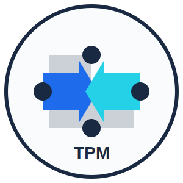
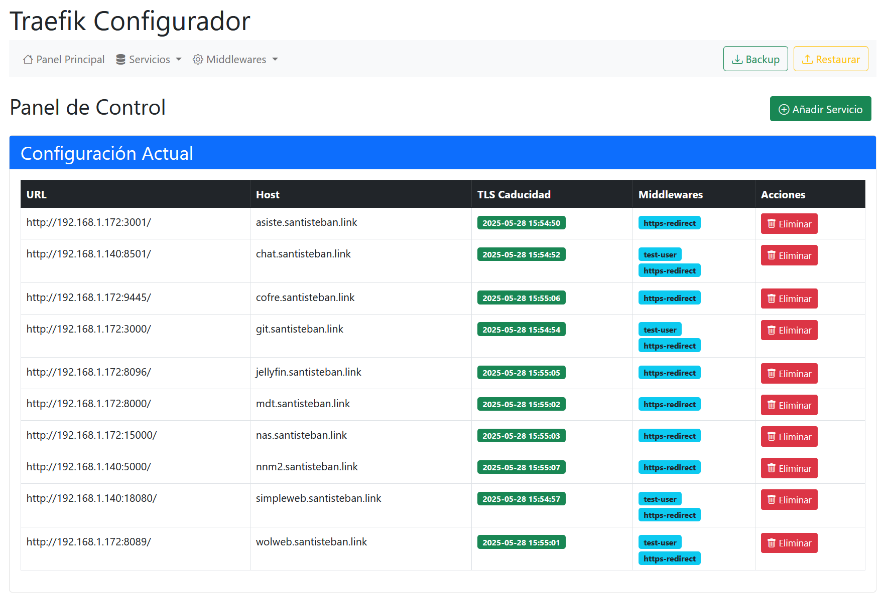
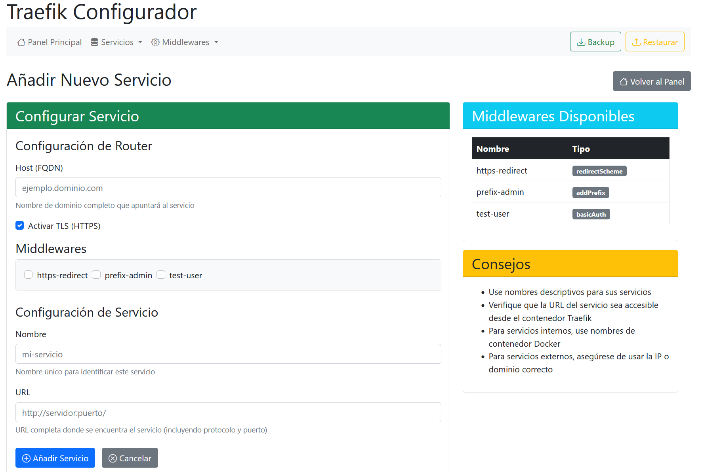

# 🚀 Simplest Traefik Proxy Manager 


[](https://buymeacoffee.com/rafasbvarix)

<p align="center">
  
</p>

## 📋 Descripción

**STPM** es una interfaz web intuitiva para gestionar y configurar Traefik como proxy inverso para servicios http que no están necesariamente en el mismo host que el contenedor de Traefik. Simplifica la administración de rutas, certificados SSL, middleware y demás configuraciones sin necesidad de editar archivos YAML manualmente.

## ✨ Características

- 🌐 **Gestión de enrutamiento**: Configura rutas para tus servicios web fácilmente
- 🔒 **Certificados SSL automáticos**: Gestión simplificada de Let's Encrypt
- ⚡ **Tiempo real**: Cambios aplicados instantáneamente sin reiniciar Traefik
- 🛡️ **Middlewares**: Configuración de seguridad, redireccionamientos, compresión y más
- 📊 **Monitorización**: Visualiza el estado de tus servicios y rutas
- **TO DO:** 🔑 **Autenticación segura**: Acceso protegido mediante clave API

## 🔧 Requisitos previos

- Docker y Docker Compose
- Puertos 80 y 443 disponibles para Traefik. El puerto 80 debe ser accesible desde el exterior para la validación de Let's Encrypt.
- Puerto 9000 disponible para el configurador. Puedes cambiarlo en el archivo `docker-compose.yml` si es necesario.

## 📦 Instalación

1. Clona este repositorio:
   ```bash
   git clone https://github.com/rafasb/traefik-configurador.git
   cd traefik-configurador
   ```

2. Recuerda cambiar el **email** en el archivo `traefik/traefik.yml` para la gestión de certificados SSL.

3. Recuerda crear y establecer los permisos del archivo `traefik/acme.json` a **600**:
   ```bash
   touch traefik/acme.json
   chmod 600 traefik/acme.json
   ```

4. Inicia los contenedores:
   ```bash
   docker compose up -d
   ```

5. Accede a la interfaz de configuración en: *Es recomendable usarlo localmente*
   ```
   http://localhost:9000
   ```

6. Accede al dashboard de Traefik en: *Es recomendable usarlo localmente*
   ```
   http://localhost:8080
   ```

7. Cambia el valor de **caServer** en el fichero `traefik/traefik.yml` tomando como referencia la documentación. Estos cambios requieren resetear el contenedor de Traefik eliminando el contenido del fichero acme.json:
  - [Let's Encrypt Staging](https://letsencrypt.org/docs/staging-environment/) 
  - [Let's Encrypt Production](https://letsencrypt.org/getting-started/)

## 📸 Capturas de pantalla

<p align="center">
  
  
  
</p>

## 🔐 Configuración de seguridad

El acceso a la API del configurador está protegido mediante una clave API definida en la variable de entorno `MIDDLEWARE_KEY`. Por defecto, se establece una clave en el archivo docker-compose.yml, pero se recomienda cambiarla por razones de seguridad.

## 🛠️ Estructura del proyecto

```
proxy-traefik/
├── docker-compose.yml    # Definición de los servicios
├── traefik/              # Configuración de Traefik
│   ├── traefik.yml       # Archivo principal de configuración estática
│   ├── acme.json         # Almacenamiento de certificados
│   ├── traefik.d/        # Configuraciones adicionales
│   │   └── http.yml      # Configuración dinámica de HTTP
├── configurador/         # Aplicación web de configuración
```

## 🔗 Integración con otros servicios docker **en el mismo host**

Para integrar tus aplicaciones con Traefik, simplemente añade las siguientes etiquetas a tus servicios Docker. 
*Esta funcionalidad es parte de Traefik y no es objeto de este proyecto*:

```yaml
labels:
  - "traefik.enable=true"
  - "traefik.http.routers.miservicio.rule=Host(`midominio.com`)"
  - "traefik.http.routers.miservicio.tls=true"
  - "traefik.http.routers.miservicio.tls.certresolver=myresolver"
  - "traefik.http.services.miservicio.loadbalancer.server.port=80"
  - "traefik.http.middlewares.miservicio.middleware=mi-middleware"
  
networks:
  - traefik-private
```

## 🤝 Contribuciones

Las contribuciones son bienvenidas. Por favor, considera:

1. Hacer fork del repositorio
2. Crear una rama para tu funcionalidad (`git checkout -b feature/nueva-funcionalidad`)
3. Hacer commit de tus cambios
4. Subir la rama (`git push origin feature/nueva-funcionalidad`)
5. Abrir un Pull Request

## 📄 Licencia

Este proyecto está bajo la Licencia MIT. Consulta el archivo `LICENSE` para más detalles.

## 📫 Contacto

Si tienes preguntas o sugerencias, no dudes en abrir un issue en este repositorio o contactarnos directamente.

<p align="center">
  ¿Te ha resultado útil este proyecto? <a href="https://buymeacoffee.com/rafasbvarix">¡Invítame a un café! ☕</a><br>
  <a href="https://buymeacoffee.com/rafasbvarix">
    
  </a>
</p>

---

<p align="center">
  Desarrollado con ❤️ para la comunidad de DevOps y administradores de sistemas
</p>
```
